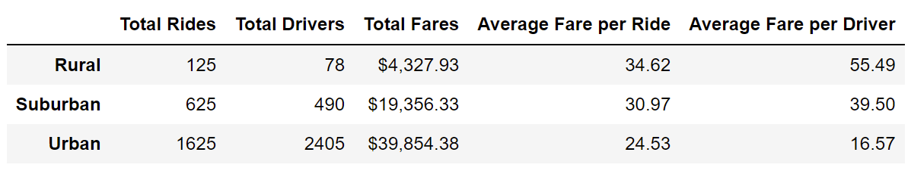
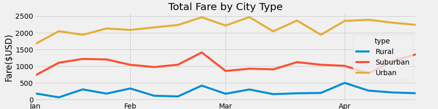

# PyBer with Matplotlib

## Overview

The purpose of this challenge was to use a ride-sharing dataset to produce a summary categorized by city type and a line graph showing the total fares per week, also categorized by city type.

## Results

* The most total rides were given in urban cities (1625), followed by suburban cities (625), and rural cities (125).
* The most drivers were employed in urban cities (2405), followed by suburban cities (490), and rural cities (78).
* The highest total fares were collected in urban cities ($39,854.38), followed by suburban cities ($19,356.33), and rural cities ($4,327.93).
* The highest average fares per ride were collected in rural cities ($34.62), followed by suburban cities ($30.97), and rural cities ($24.53).
* The highest average fares per driver were collected in rural cities ($55.49), followed by suburban cities ($39.50), and rural cities ($16.57).

* The highest total weekly fares were collected in urban cities, followed by suburban cities, and rural cities ($4,327.93).

## Summary

There were more drivers in urban cities than rides given, so the average fare per driver was much lower as some drivers didn't earn anything. We should reduce the number of drivers in urban cities. Average fares were high in suburban cities, so we should recruit more drivers in those cities or transfer over some of the urban drivers. Average fares were the highest in rural cities, but they accounted for only 5% of the total rides. We should try advertising in rural cities to increase demand.